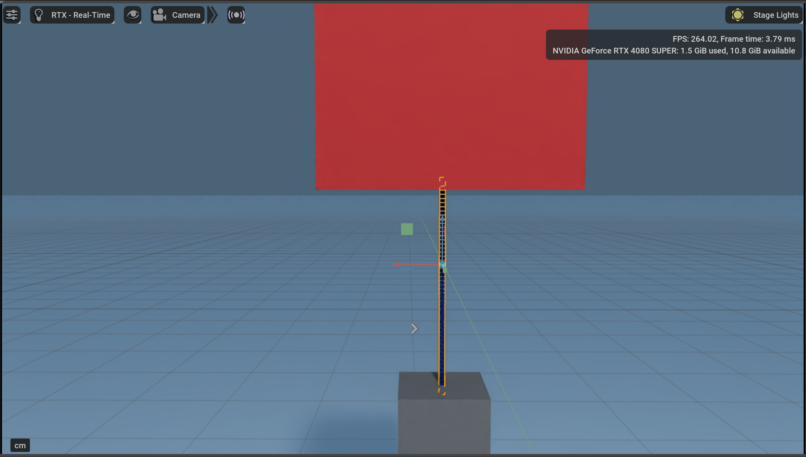

# Auto-Multilift Simulation
This reop is the simulation of the [Auto-Multilift](https://github.com/RCL-NUS/Auto-Multilift) project. Currently, **Isaac Sim 4.2.0** is used for simulation. For the installation of Isaac Sim, please read the [offical doc](https://docs.omniverse.nvidia.com/isaacsim/latest/installation/index.html) provided by Nvidia.

## Rope simulation

### MSD simulation of ropes
The current simulation of the elastic rope is implemented using multi-rigid-body simulation.The simulation is based on the Mass-Spring-Damper (MSD) model of the rope. The **Mass-Spring-Damper (MSD)** model for simulating ropes treats the rope as a series of connected masses (nodes) linked by springs and dampers. The equations for each mass describe its motion under the influence of forces applied by springs, dampers, and external factors. The simulation uses a [D6 joint](https://docs.nvidia.com/gameworks/content/gameworkslibrary/physx/apireference/files/classPxD6Joint.html) to connect the rigid body links, allowing for customizable degrees of freedom between the links.

#### 1. Force Equation for a Single Mass
The motion of each mass is governed by Newton's Second Law:

$$
m \frac{d^2 x_i}{dt^2} = F_{\text{spring}} + F_{\text{damper}} + F_{\text{external}}
$$

Where:
- $m$: Mass of a single node.
- $x_i$: Position of the $i$-th mass.
- $F_{\text{spring}}$: Force due to the springs.
- $F_{\text{damper}}$: Force due to the dampers.
- $F_{\text{external}}$: Includes gravity or other external forces.

#### 2. Spring Force
The spring force is proportional to the displacement between two connected nodes:

$$
F_{\text{spring}} = k (x_j - x_i - L_0)
$$

Where:
- $k$: Spring constant (stiffness).
- $x_j$ and $x_i$: Positions of the connected nodes.
- $L_0$: Rest length of the spring.

#### 3. Damping Force
The damping force is proportional to the relative velocity between two connected nodes:

$$
F_{\text{damper}} = c \left(\frac{dx_j}{dt} - \frac{dx_i}{dt}\right)
$$

Where:
- $c$: Damping coefficient.
- $\frac{dx_j}{dt}$ and $\frac{dx_i}{dt}$: Velocities of the connected nodes.

#### 4. External Forces
The external forces typically include:
- **Gravity**: $F_{\text{gravity}} = m g$, where $g$ is the acceleration due to gravity.
- **External constraints**: Such as collisions or interactions with other objects.

### FEM Simulation of Ropes

Isaac Sim provides [deformable body simulation](https://docs.omniverse.nvidia.com/extensions/latest/ext_physics/deformable-bodies.html), featuring GPU-accelerated **finite-element-method (FEM)** simulation. This allows users to add deformable-body dynamics to mesh assets. Deformable materials can be assigned to mesh assets, with parameters such as Young's Modulus, Dynamic Friction, and Poisson's Ratio bound to the deformable body.

During the simulation of the elastic rope, it is crucial to consider both the rope's tension and flexibility. The formulas governing the rope's tension and flexibility differ, requiring different Young's moduli for the radial and tangential directions to achieve an accurate simulation. However, in ISAAC Sim's deformable material settings, **the Young's modulus for both directions can only be assigned using a single unified parameter.** This limitation makes it challenging to balance the simulation of both the rope's tension and flexibility. Achieving accurate tension simulation requires assigning a high Young's modulus to the material. However, a high Young's modulus results in the rope becoming excessively stiff and resistant to bending, leading to an unrealistic representation of its flexibility.

After experimenting with the finite element method (FEM) for simulating deformable ropes, this approach was temporarily abandoned due to these limitations. A high-stiffness rope model based on the FEM approach is provided in the file [FEMCable.usd](https://github.com/CarlsonGYC/Auto-Multilift_simulation/blob/isaac/FEMCable.usd) for reference.

## Other Considerations
Currently, to ensure the accuracy of the simulation, we have set `timeStepPerSecond` to 1000. This simulation will be further integrated with the [Pegasus Simulator (modified by our team)](https://github.com/Temasek-Dynamics/PegasusSimulator) to achieve SITL simulation using PX4.

This is an ongoing and unfinished project. We value your suggestions and feedback. For further questions or contributions, please contact **yichao_gao@u.nus.edu**.
