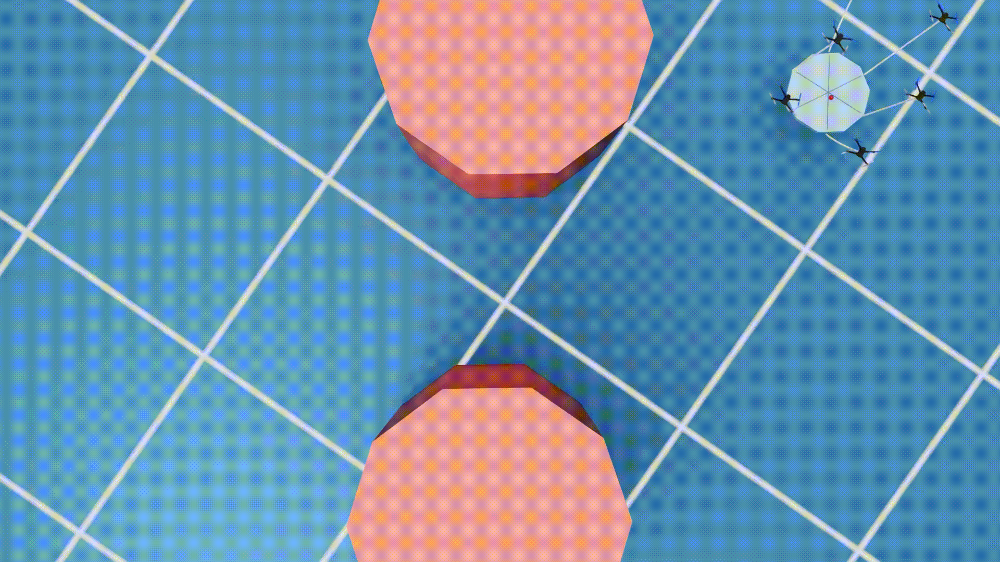

# L2C simulation
[](https://docs.isaacsim.omniverse.nvidia.com/4.2.0/index.html)
[](https://px4.io)
[](https://releases.ubuntu.com/jammy/)
[](https://github.com/PegasusSimulator/PegasusSimulator.git)
[](https://docs.python.org/3/whatsnew/3.10.html)

This is the ROS2 workspace of [Learning to Coordinate](https://github.com/BinghengNUS/Learning_to_Coordinate_1.git) simulation. 
|     Three-UAV| Six-UAV| Seven-UAV|
|-----------------------------------------------------------|--------------------------------------------------------------|--------------------------------------------------------------|
 |  | 


## Simulation
After training of the L2C code, you may run the simulation via putting the offline trajectory same as [structure.txt](./structure.txt). 

The given [folder](./iris_modified/) is the example from the developer. Please make sure the self-configured [model](./iris_modified/iris_modified.usd) and [parameter of PX4](./iris_modified/10021_iris_modified) is correctly setup. 

Please install tmux before running the demo code:

```bash
sudo apt-get install tmux
```

Please run:

```bash
git submodule update --init --recursive
```
to pull the submodules required for this ros2 workspace and run
```bash
colcon build
```
to build the ros2 workspace.

For easier launch of the simulation, a bash script is written to launch the simulation demo. Run 

```bash
bash ./launch_sitl_tmux.sh
```

to run the single iris drone offboard control demo. 

To exit the demo, please run:
```bash
tmux kill-session sitl
```

## For developers 
To develop on the code, you may neeed to run [SimulatorSetup](https://github.com/Temasek-Dynamics/SimulatorSetup.git) for easier install.
```bash
git clone https://github.com/Temasek-Dynamics/SimulatorSetup.git -b dev_yichao
```

 - The Isaac Sim simulator related code is in [src/sitl_sim/sitl_sim/iris_modified_sitl.py](./src/sitl_sim/sitl_sim/iris_modified_sitl.py)
 - To change the center of mass of the payload, you need to modify [src/sitl_sim/sitl_sim/cable_model.py, line 46](./src/sitl_sim/sitl_sim/cable_model.py#L46)
 - To change the number of drones and the path of the offline trajectory, please modify [src/px4-offboard/px4_offboard/get_data.py](./src/px4-offboard/px4_offboard/get_data.py), [Line #18](./src/px4-offboard/px4_offboard/get_data.py#L18) for the number of drones and [Line #24](./src/px4-offboard/px4_offboard/get_data.py#L24) for the path of the offline trajectory.

The code of the simulation and the geometric controller for the multilift system may need to be modified due to the difference of the PX4 versions. 

Run 
```bash
ros2 topic list
```
to verify the topic names in the SITL simulation. Be aware that certain topics may carry a `_v1` suffix.

You may need to check [src/px4-offboard/px4_offboard/geom_multilift.py](./src/px4-offboard/px4_offboard/geom_multilift.py#421) to make sure the topic name matches the real topic in use.

Please contact the developer if you encounter any other problems.

## Contact Us
If you encounter a bug in your implementation of the code, please do not hesitate to inform me.
* Name: Dr. Bingheng Wang
* Email: wangbingheng@u.nus.edu

## References

[PX4 control diagram](https://docs.px4.io/main/en/flight_stack/controller_diagrams.html)

[px4_offboard](https://github.com/Jaeyoung-Lim/px4-offboard) (Demo source)

[ROS 2 Offboard Control Example](https://docs.px4.io/main/en/ros2/offboard_control.html)
